
<a href="README.md">EN</a> · <strong>БГ</strong>

<picture><source media="(max-width: 650px)" srcset="assets/generated/hero-bg-mobile.svg"></picture>

<a href="#command-center">Център</a> · <a href="#featured-systems">Основни системи</a> · <a href="#all-projects">Всички проекти</a> · <a href="#architecture">Архитектура</a> · <a href="#activity">Активност</a> · <a href="#contact">Контакт</a>

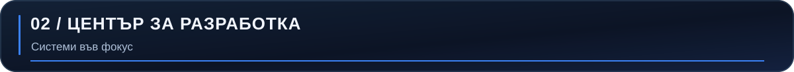

<picture><source media="(max-width: 650px)" srcset="assets/generated/command-bg-mobile.svg"></picture>

Работя по локални инструменти за разработчици, FiveM сървърни ресурси и уеб администриране. Технологиите са проверени в прегледаните хранилища; инвентарът различава личните проекти от съвместния принос.

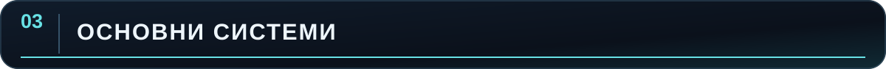

### AstroByte CodeGuard · локален анализ на код

<picture><source media="(max-width: 650px)" srcset="assets/generated/feature-codeguard-bg-mobile.svg"></picture>

**Проблем → решение.** Находките се нуждаят от доказателства, а поправките — от контролиран преглед. CodeGuard съчетава Rust скенер и CLI с macOS приложение чрез Tauri 2 и React. Показва контекст и находки, а при желание иска предложение от OpenAI или Anthropic. Промяната се вижда като diff, изисква изрично одобрение, проверява се и остава в история за защитено връщане.

**Моят принос:** лично хранилище с авторска активност. **Инженерни решения:** локално сканиране, ограничен и редактиран AI контекст, ключове в macOS Keychain, контролиран достъп до файловете на проекта и връщане при проверен конфликт са описани в документацията. **Статус:** частна разработка; няма публичен код или линк към релийз.

### Платформа за правила · full-stack продукт

<picture><source media="(max-width: 650px)" srcset="assets/generated/feature-rules-bg-mobile.svg"></picture>

**Проблем → решение.** Правилата на сървър се нуждаят от публичен изглед и контролиран редакторски процес. Частният личен проект използва Next.js, React, TypeScript, PostgreSQL и Prisma. Документацията описва Discord OAuth администрация, чернови и публикуване, история на версиите, сървърни проверки на достъпа и одитен журнал.

**Моят принос:** лично хранилище с авторски commit-и. **Статус:** частно; не твърдя, че има публично демо.

### DMV таблет · FiveM процес

<picture><source media="(max-width: 650px)" srcset="assets/generated/feature-dmv-bg-mobile.svg"></picture>

**Проект:** частен Qbox ресурс на AstroByte Development с FiveM NUI таблет, Lua клиент и сървър, записи за регистрация и MySQL. README описва регистрация, история на номерата, QR проверка и локализация.

**Моят принос:** има авторски commit-и, включително промяна по релийз. Това е **организационен проект**; не си приписвам цялата система. **Статус:** частен код.

### Бизнес регистър · FiveM записи

<picture><source media="(max-width: 650px)" srcset="assets/generated/feature-registry-bg-mobile.svg"></picture>

**Проект:** частен Qbox ресурс на AstroByte Development за бизнес записи и документи. README описва сървърна валидация, MySQL журнал, локализация и интерфейс тип таблет.

**Моят принос:** видим е авторски първоначален commit. Това доказва принос, но не и еднолична собственост върху всяка следваща промяна. **Статус:** частен код.

### Съвместна FiveM сървърна инфраструктура

<picture><source media="(max-width: 650px)" srcset="assets/generated/feature-collaboration-bg-mobile.svg"></picture>

**Проект:** споделено частно FiveM хранилище в акаунта на друг разработчик. **Моят принос:** при одита са установени 44 авторски commit-а в достъпните клонове, включително промяна по базата данни. Това е **съвместен проект**; визуализацията описва общата система и не представя цялата реализация като моя. **Статус:** частен код.

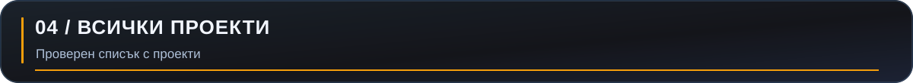

<picture><source media="(max-width: 650px)" srcset="assets/generated/matrix-bg-mobile.svg">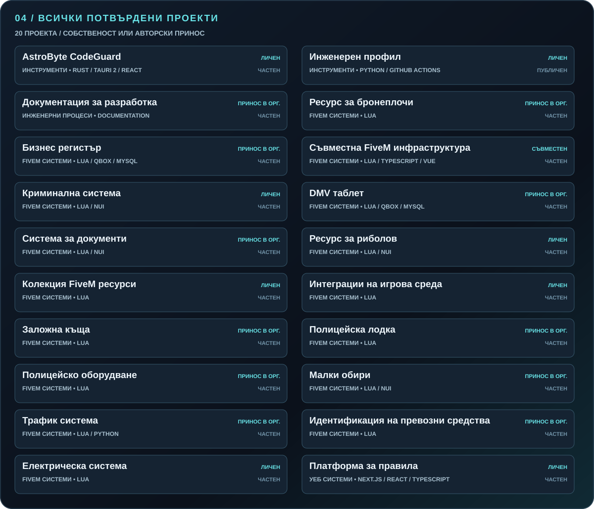</picture>

Матрицата се генерира от [публично безопасния инвентар](data/projects.json). Съдържа всичките 20 достъпни хранилища с лична собственост или установен авторски принос, включително този профил. Пет други организационни хранилища са прегледани и изключени поради липса на установен авторски принос. Частните записи използват описателни имена и не съдържат URL адреси. Един commit доказва авторска промяна, но не еднолично авторство на проекта. [Метод и ограничения](docs/discovery.md).

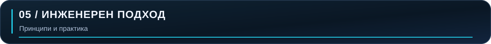

<picture><source media="(max-width: 650px)" srcset="assets/generated/engineering-bg-mobile.svg">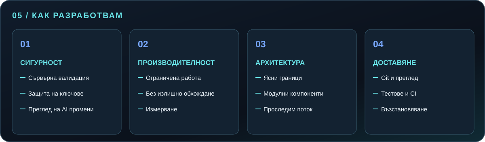</picture>

Най-силните доказателства са в системите: изричният diff преглед и защитеното връщане в CodeGuard; сървърният контрол на достъпа, версиите и одитният журнал в платформата за правила; и сървърната валидация в Qbox регистъра. Това са решения за конкретни проекти, а не твърдение, че всеки ресурс има еднакви защити.

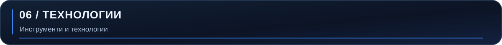

<picture><source media="(max-width: 650px)" srcset="assets/generated/technology-bg-mobile.svg"></picture>

Езиковата активност измерва **докосвания на файлове с изходен код в мои немърджващи commit-и** от достъпните лични и съвместни хранилища. Файл, променен в два commit-а, се брои два пъти. Това не измерва собственост върху кода или умения и не публикува частен код. Данните се обновяват само при одит с достъп; публичният workflow няма достъп до частните хранилища. [Метод](docs/discovery.md).

<picture><source media="(max-width: 650px)" srcset="assets/generated/languages-bg-mobile.svg"></picture>

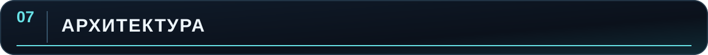

Това са обобщени карти на компоненти, потвърдени от документацията или структурата на хранилищата. Незадължителните и вътрешните пътища са умишлено опростени.

<picture><source media="(max-width: 650px)" srcset="assets/generated/architecture-codeguard-bg-mobile.svg"></picture>

<picture><source media="(max-width: 650px)" srcset="assets/generated/architecture-rules-bg-mobile.svg"></picture>

<picture><source media="(max-width: 650px)" srcset="assets/generated/architecture-dmv-bg-mobile.svg"></picture>

<picture><source media="(max-width: 650px)" srcset="assets/generated/architecture-collaboration-bg-mobile.svg"></picture>

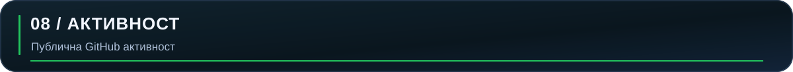

<picture><source media="(max-width: 650px)" srcset="assets/metrics/activity-bg-mobile.svg"></picture>

Картата се обновява от календара на GitHub. Приносите не са равни на commit-и, часове или собственост върху проекти. Датата върху картата показва кога е генерирана. [Метод](docs/metrics.md).

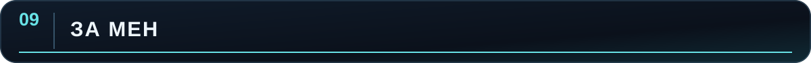

Работя на границата между продуктов интерфейс и системна логика: скенер с контролирани AI предложения, административни процеси с ясни права и FiveM ресурси, свързани със сървърна логика и постоянни данни. Използвам Git, тестове и документация, за да могат системите да се променят и възстановяват по-лесно.

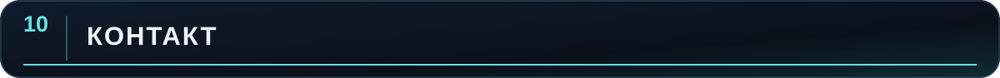

За инструменти за разработчици, FiveM системи или full-stack администриране [свържете се с мен през GitHub](https://github.com/gopeto222). Имейл, сайт и Discord ще се появят тук, когато има публични адреси.

AstroByte Development · Георги Канчев · <a href="README.md">English version</a>
