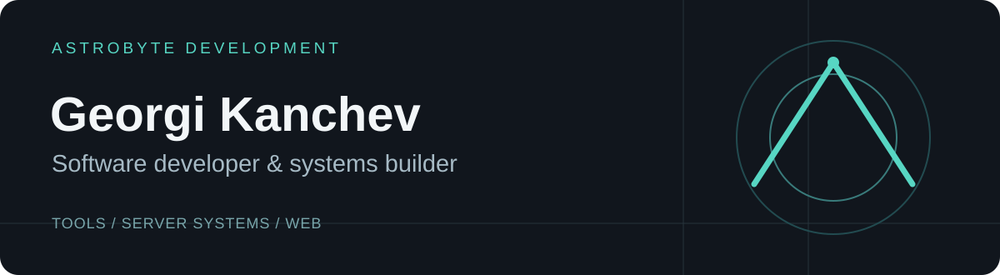
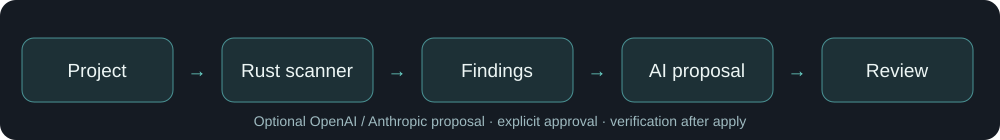
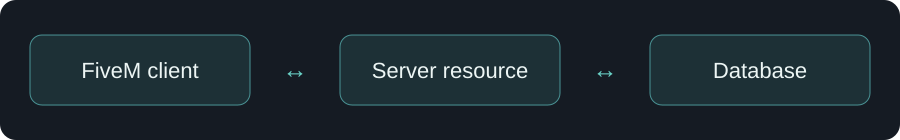
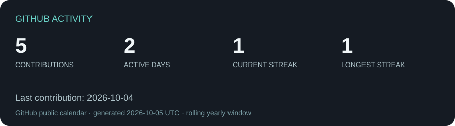

<a href="README.md">English</a> · <strong>Български</strong>

<strong>Full-stack системи · FiveM инфраструктура · Инструменти за разработчици · Автоматизация</strong>

Разработвам софтуер, който свързва интерфейси, сървърна логика и работни процеси. Работата ми включва локален анализ на код, FiveM ресурси и уеб инструменти за администриране. Държа на ясни граници на доверие, поддържаеми модули и промени, които могат да се прегледат.

<a href="#избрани-проекти">Проекти</a> · <a href="#инженерен-подход">Подход</a> · <a href="#технологии">Технологии</a> · <a href="#активност-в-github">Активност</a> · <a href="#контакт">Контакт</a>

## Избрани проекти

### AstroByte CodeGuard · инструмент за разработчици

**Проблем.** Резултатът от сканиране е полезен, когато разработчикът може да провери доказателствата и безопасно да оцени предложената поправка.

**Решение.** Локален Rust скенер и CLI захранват настолно приложение с Tauri 2, React и TypeScript. Приложението показва находки и контекст от кода и предлага незадължителни поправки чрез OpenAI или Anthropic. Промяната се показва като diff и изисква изрично одобрение. Историята на поправките поддържа проверка и защитено връщане.

**Архитектура.** `проект → Rust скенер → находки → незадължително AI предложение → преглед → прилагане → проверка`.

**Моят принос.** Лично хранилище в моя акаунт. **Статус.** Активна частна разработка; кодът и компилацията не са публични. Описанието е основано на README и структурата на проекта, а не на твърдение за публична версия.

### FiveM системи · разработка на ресурси

Поддържам Lua ресурси и сървърни модификации в лични хранилища и имам авторски commit-и в избрани хранилища на AstroByte Development. Потвърдената работа обхваща бизнес регистър, DMV, документи и ресурси, свързани с превозни средства. Организационната работа е съвместна и частна; описанията посочват областта, без да публикуват код или да ми приписват чужди commit-и.

**Инженерен подход.** Граници между клиент и сървър, съхранение на данни и интеграция на ресурси. Свойствата за сигурност и производителност трябва да се оценяват за всеки ресурс поотделно.

### Уеб администриране · частен проект

Лично TypeScript хранилище е описано като сайт с правила за FiveM сървър и Discord административен панел. То е частно, затова тук няма линк към кода или твърдение за работещо демо. Публичният ми профил описва и опит с backend, бази данни и Discord интеграции; конкретни реализации няма да бъдат изброявани, докато не могат да бъдат споделени.

## Инженерен подход

| Област | Върху какво работя |
| --- | --- |
| Инструменти за разработчици | Локален анализ, находки с доказателства, контролирани AI поправки |
| FiveM | Lua ресурси, интеграции в екосистемата Qbox, клиентски и сървърни процеси |
| Уеб системи | TypeScript интерфейси и административни процеси |
| Операции | Автоматизация, Git процеси и поддържаеми доставки |

## Технологии

**Потвърдени в прегледаните хранилища:** Rust, Lua, TypeScript, React, Tauri 2, Python, интеграции с OpenAI и Anthropic. Настолното приложение CodeGuard е за macOS; текущият интерфейс е Tauri/React, а не SwiftUI.

**От съществуващия ми профил и частната FiveM работа:** JavaScript, Node.js, MySQL, Qbox, `ox_lib`, `ox_target`, `ox_inventory` и `oxmysql`. Това са области на опит, без твърдение, че всеки показан проект ги използва.

## Активност в GitHub

Графиката използва публичния календар с приноси в GitHub за този акаунт. Приносите включват и дейности, различни от commit-и. Тя не разкрива частни хранилища и не измерва отработени часове. Автоматизацията обновява графиката ежедневно; датата върху нея показва кога е генерирана. [Метод на измерване](docs/metrics.md).

## Контакт

За инструменти за разработчици, FiveM системи и уеб администриране [свържете се с мен през GitHub](https://github.com/gopeto222). Други канали ще бъдат добавени, когато има публичен адрес.

AstroByte Development · Георги Канчев
