<!-- Generated from data/profile.json and data/projects.json by scripts/build_readmes.py. -->

<a href="README.md" title="Към английската версия"><picture><source media="(max-width: 650px)" srcset="assets/generated/hero-bg-mobile.svg">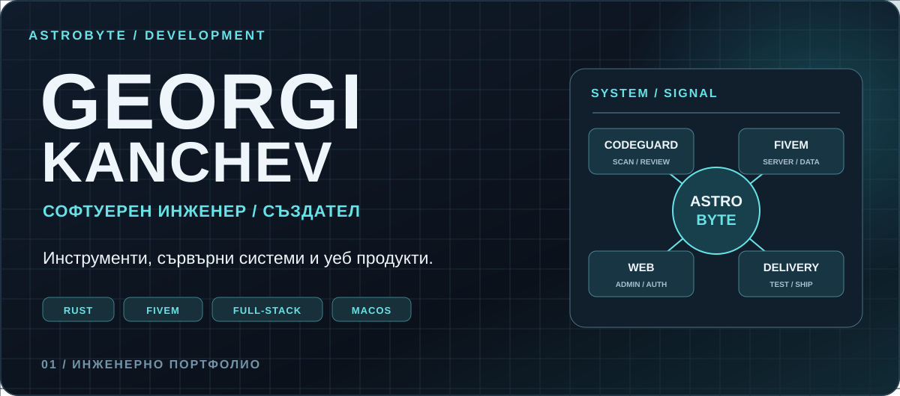</picture></a>

<a href="#featured">Основни системи</a> · <a href="#archive">Всички проекти</a> · <a href="#technology">Технологии</a> · <a href="#activity">Активност</a> · <a href="#contact">Контакт</a>

Разработвам локални инструменти, уеб приложения за администрация и FiveM системи. По-долу личните проекти са разграничени от установения принос в обща работа.

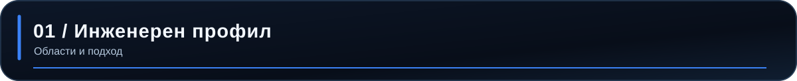

<picture><source media="(max-width: 650px)" srcset="assets/generated/command-bg-mobile.svg">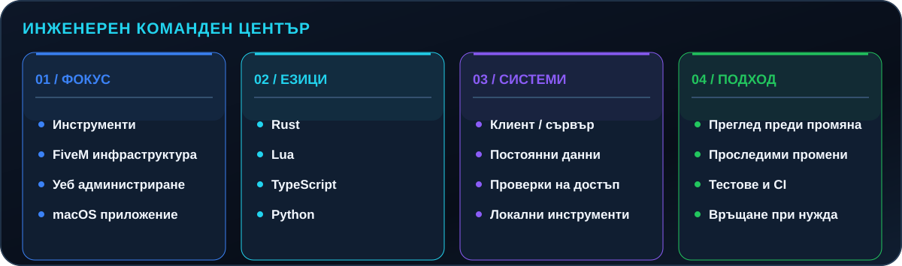</picture>

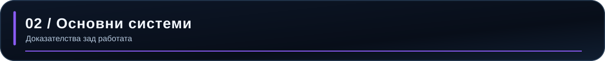

Подбраните проекти са описани според проверените хранилища. Частният код остава частен.

### AstroByte CodeGuard

<picture><source media="(max-width: 650px)" srcset="assets/generated/feature-codeguard-bg-mobile.svg">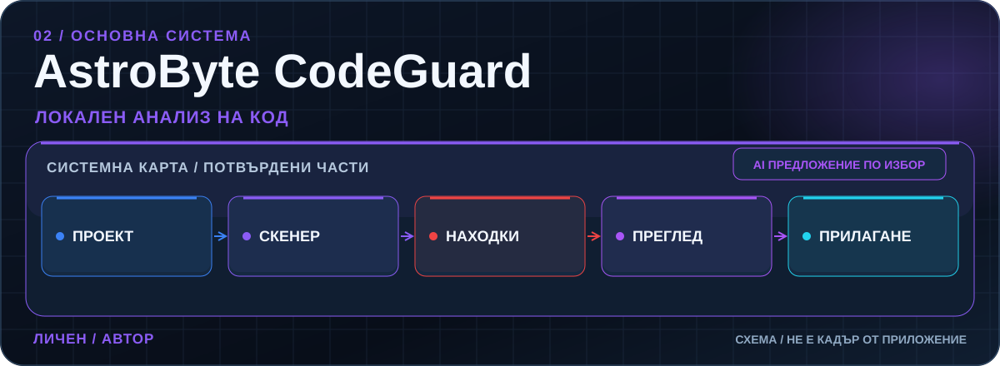</picture>

Проверена системна схема; не е кадър от приложението.

- **Проблем:** Находките се нуждаят от контекст, а предложените поправки — от преглед и възможност за връщане.
- **Система:** Rust скенер и CLI с macOS интерфейс чрез Tauri 2 и React. Предложенията от OpenAI или Anthropic са незадължителни и се показват като diff преди изрично одобрение.
- **Моят принос:** Личен проект с установени авторски commit-и.
- **Инженерно решение:** Локално сканиране, ограничен и редактиран AI контекст, ключове в Keychain и връщане след проверка за конфликти.
- **Статус:** Частна разработка; не се твърди публичен релийз.
- **Технологии:** Rust · Tauri 2 · React · TypeScript · OpenAI · Anthropic

### Платформа за правила

<picture><source media="(max-width: 650px)" srcset="assets/generated/feature-rules-bg-mobile.svg">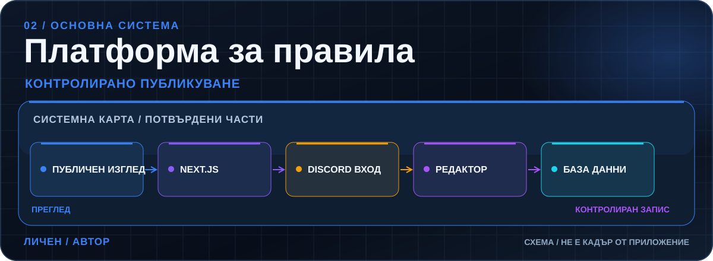</picture>

Проверена системна схема; не е кадър от приложението.

- **Проблем:** Правилата имат нужда от удобен публичен изглед и контролиран редакторски процес.
- **Система:** Next.js, React, TypeScript, PostgreSQL и Prisma с Discord OAuth администрация, чернови, версии и одитни записи.
- **Моят принос:** Личен проект с установени авторски commit-и.
- **Инженерно решение:** Сървърни проверки на достъпа и проследим път от чернова до публикуване.
- **Статус:** Частен код; не се твърди публично демо.
- **Технологии:** Next.js · React · TypeScript · PostgreSQL · Prisma

### DMV таблет

<picture><source media="(max-width: 650px)" srcset="assets/generated/feature-dmv-bg-mobile.svg">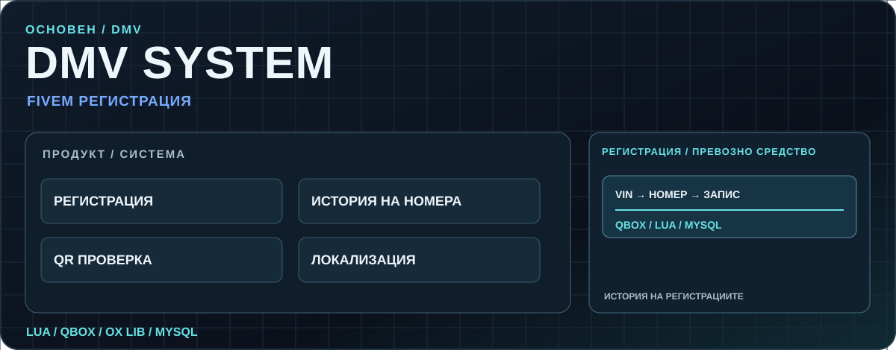</picture>

Проверена системна схема; не е кадър от приложението.

- **Проблем:** Регистрацията на превозни средства изисква процес в играта с постоянни записи и проследима история.
- **Система:** FiveM NUI таблет, Lua код за клиент и сървър, Qbox и MySQL. Документацията описва регистрация, история на номерата, QR проверка и локализация.
- **Моят принос:** Има авторски commit-и, включително промяна по релийз; проектът е организационен.
- **Инженерно решение:** Системата свързва клиентския интерфейс със сървърна логика и постоянни данни.
- **Статус:** Частен организационен код.
- **Технологии:** Lua · Qbox · MySQL · NUI

### Бизнес регистър

<picture><source media="(max-width: 650px)" srcset="assets/generated/feature-registry-bg-mobile.svg">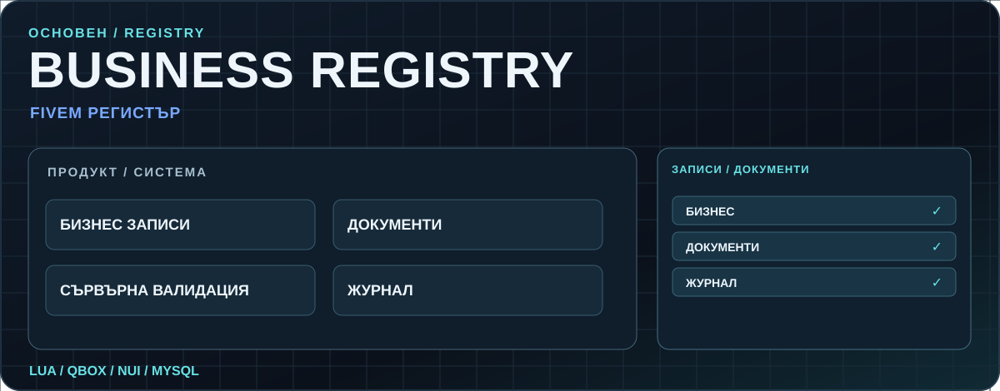</picture>

Проверена системна схема; не е кадър от приложението.

- **Проблем:** Бизнес записите и документите изискват подреден процес със сървърни проверки.
- **Система:** Qbox ресурс с таблет интерфейс, MySQL записи, локализация и журнал, описани в хранилището.
- **Моят принос:** Установен е авторски първоначален commit. Това не доказва еднолична собственост върху по-късните промени.
- **Инженерно решение:** Сървърната валидация защитава записите, а журналът прави промените проследими.
- **Статус:** Частен организационен код.
- **Технологии:** Lua · Qbox · MySQL

### Съвместна FiveM инфраструктура

<picture><source media="(max-width: 650px)" srcset="assets/generated/feature-collaboration-bg-mobile.svg">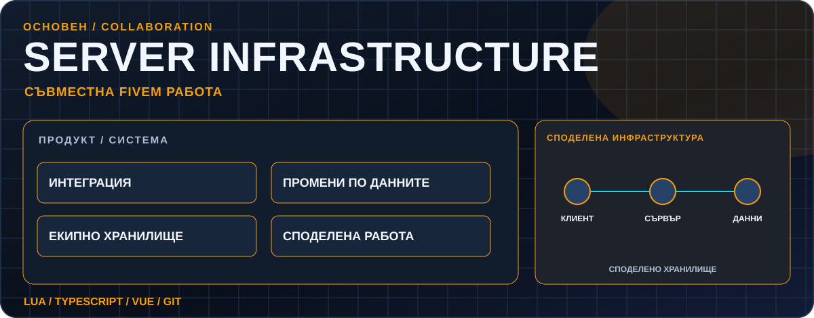</picture>

Проверена системна схема; не е кадър от приложението.

- **Проблем:** Споделената FiveM система изисква координирани промени по ресурси и данни.
- **Система:** В достъпната история се вижда работа по Lua и TypeScript ресурси и промяна по базата данни в частно споделено хранилище.
- **Моят принос:** Установени са 44 авторски commit-а в достъпните клонове. Цялата система не се приписва на един човек.
- **Инженерно решение:** Портфолиото обозначава системата като съвместна и ограничава твърденията до установената работа.
- **Статус:** Частен съвместен код.
- **Технологии:** Lua · TypeScript · Vue

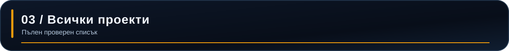

20 проверени проекта от 25 достъпни хранилища. 5 организационни хранилища са изключени, защото не е установен авторски принос. Личните, организационните и съвместните проекти са обозначени отделно. [Метод на одита](docs/discovery.md).

#### Инструменти

<picture><source media="(max-width: 650px)" srcset="assets/generated/archive-tools-bg-mobile.svg">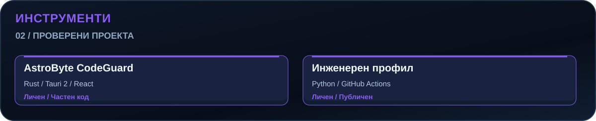</picture>

#### Инженерни процеси

<picture><source media="(max-width: 650px)" srcset="assets/generated/archive-operations-bg-mobile.svg">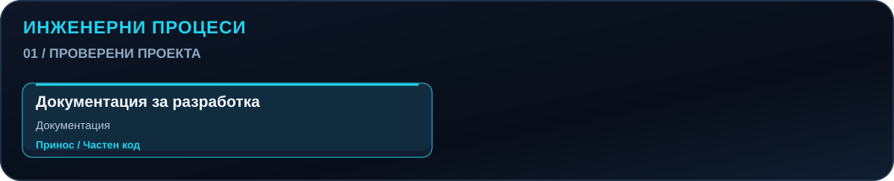</picture>

#### FiveM системи

<picture><source media="(max-width: 650px)" srcset="assets/generated/archive-fivem-bg-mobile.svg">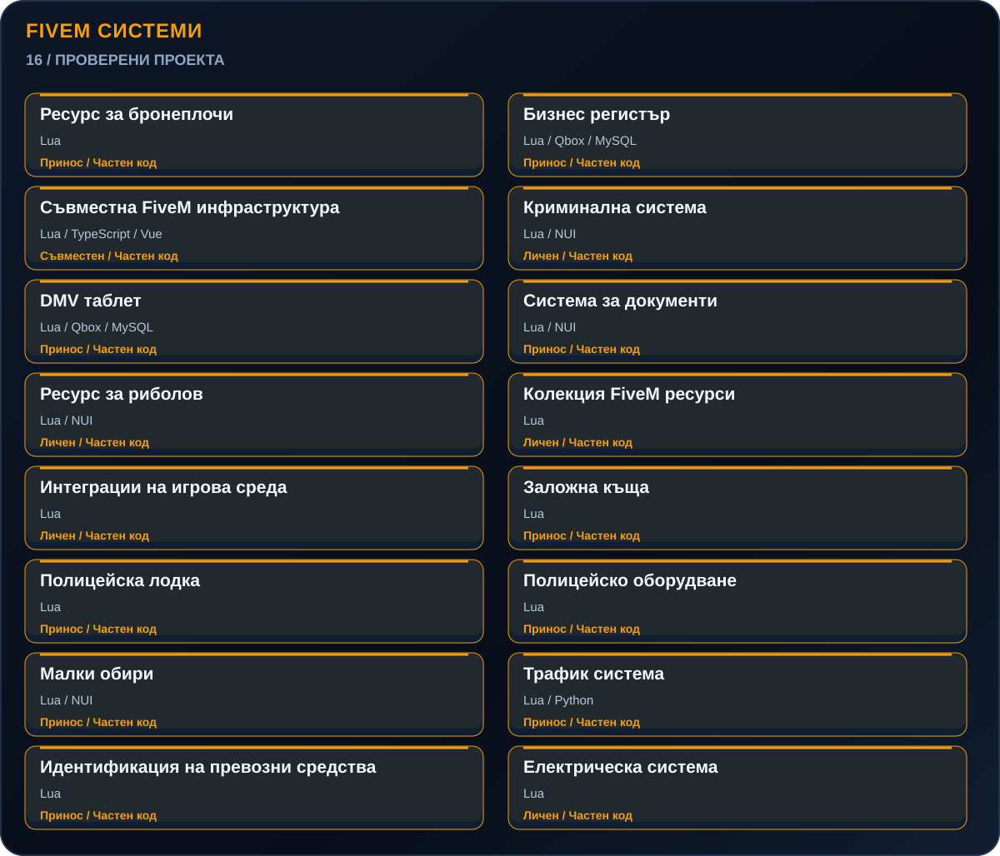</picture>

#### Уеб системи

<picture><source media="(max-width: 650px)" srcset="assets/generated/archive-web-bg-mobile.svg">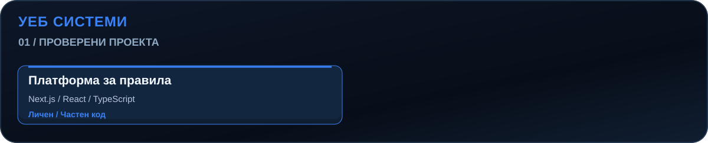</picture>

[Публичен код: хранилището на този профил](https://github.com/gopeto222/gopeto222).

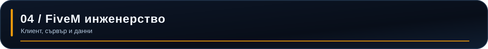

<picture><source media="(max-width: 650px)" srcset="assets/generated/fivem-bg-mobile.svg">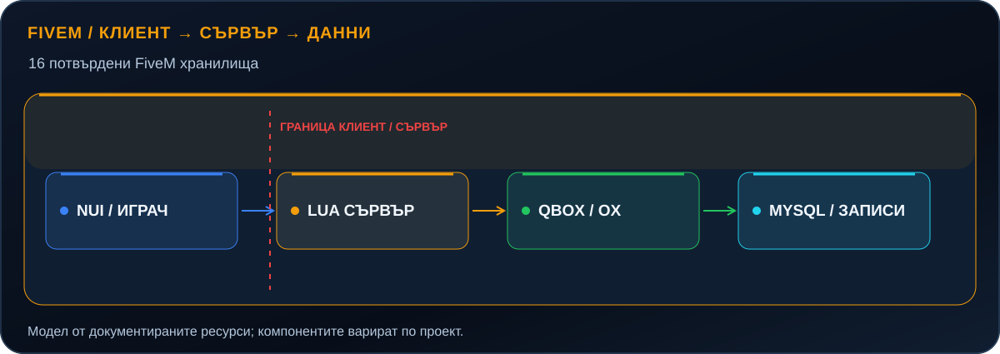</picture>

Това е модел от документираните ресурси, а не твърдение, че всеки проект използва всички компоненти. DMV и регистърът по-горе са конкретни примери.

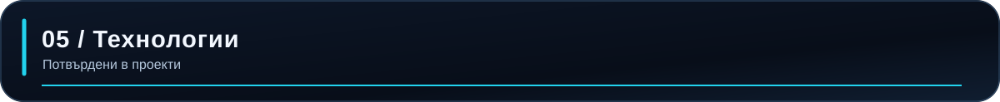

<picture><source media="(max-width: 650px)" srcset="assets/generated/technology-bg-mobile.svg">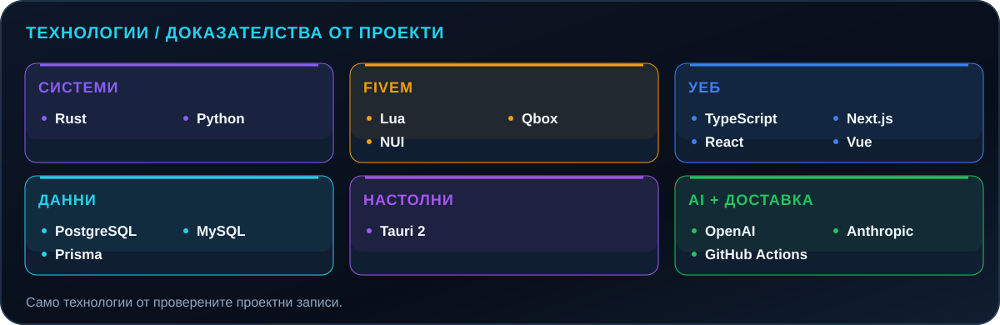</picture>

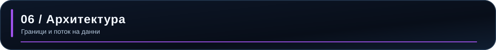

Схемите показват документирани компоненти и важни граници. Незадължителните интеграции са обозначени.

#### AstroByte CodeGuard

<picture><source media="(max-width: 650px)" srcset="assets/generated/architecture-codeguard-bg-mobile.svg">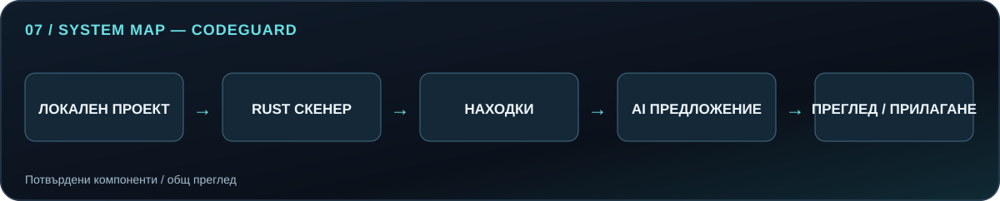</picture>

#### Платформа за правила

<picture><source media="(max-width: 650px)" srcset="assets/generated/architecture-rules-bg-mobile.svg">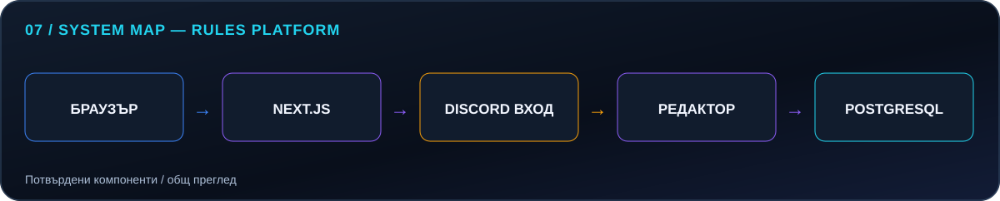</picture>

#### DMV таблет

<picture><source media="(max-width: 650px)" srcset="assets/generated/architecture-dmv-bg-mobile.svg">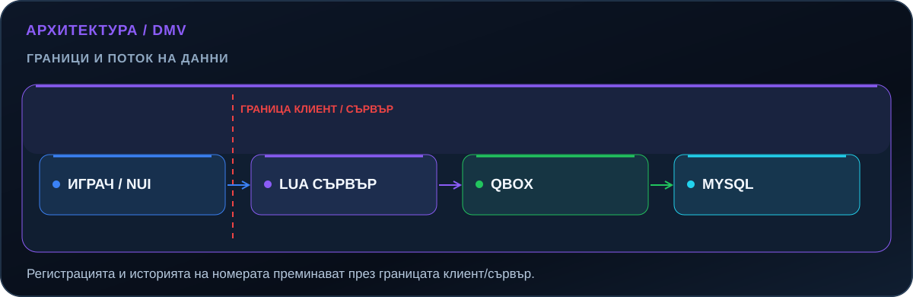</picture>

Още архитектурни схеми

#### Бизнес регистър

<picture><source media="(max-width: 650px)" srcset="assets/generated/architecture-registry-bg-mobile.svg">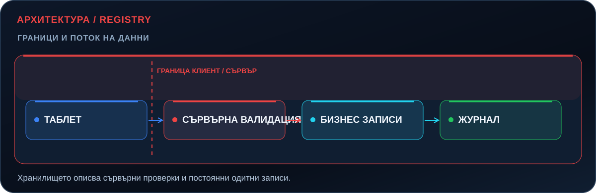</picture>

#### Съвместна FiveM инфраструктура

<picture><source media="(max-width: 650px)" srcset="assets/generated/architecture-collaboration-bg-mobile.svg">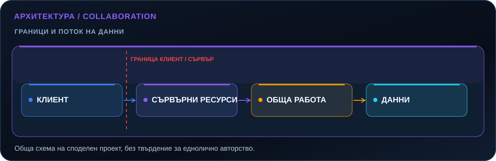</picture>

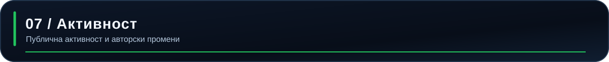

<picture><source media="(max-width: 650px)" srcset="assets/metrics/activity-bg-mobile.svg">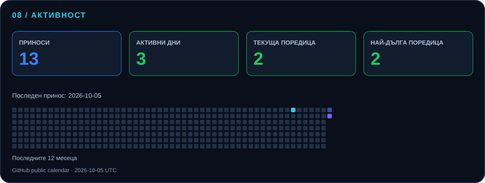</picture>

Картата се генерира от публичния календар на GitHub. Броят не измерва часове, собственост върху код или влияние на проекта. [Метод](docs/metrics.md).

<picture><source media="(max-width: 650px)" srcset="assets/generated/languages-bg-mobile.svg">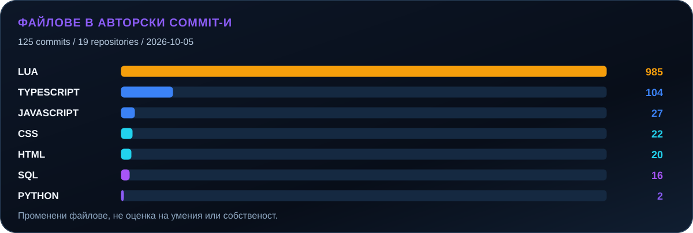</picture>

Езиковата активност е датирана извадка от промени по файлове в авторски commit-и. Тя не измерва умения. [Ограничения](docs/discovery.md).

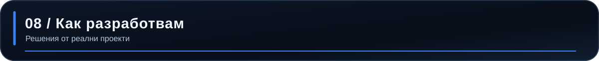

<picture><source media="(max-width: 650px)" srcset="assets/generated/practice-bg-mobile.svg">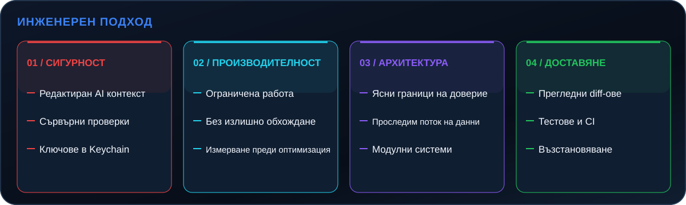</picture>

Това са примери от конкретни проекти, а не твърдение, че всяко хранилище има еднакви защити.

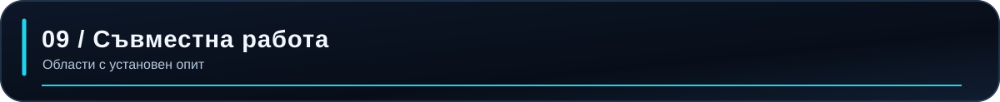

<picture><source media="(max-width: 650px)" srcset="assets/generated/services-bg-mobile.svg">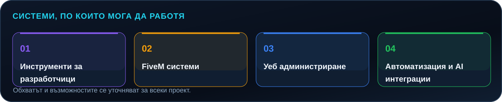</picture>

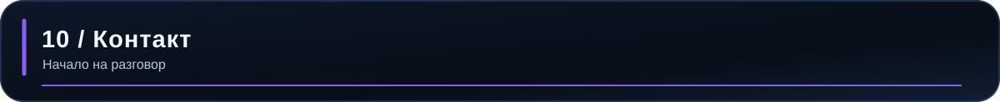

Имате идея за инструмент, платформа или система? Нека започнем с конкретния проблем и разговор в GitHub.

<a href="https://github.com/gopeto222" title="Свържете се с Георги в GitHub"><picture><source media="(max-width: 650px)" srcset="assets/generated/contact-bg-mobile.svg">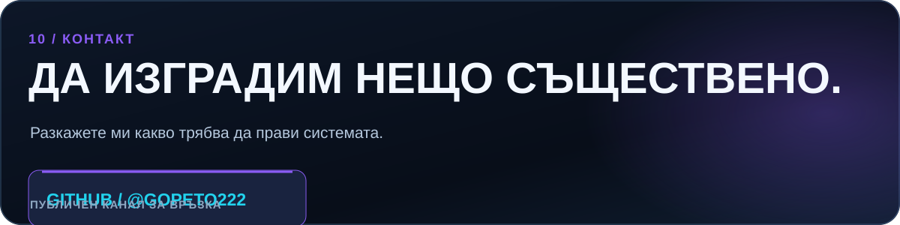</picture></a>

AstroByte Development · Георги Канчев · <a href="README.md">Към английската версия</a>
