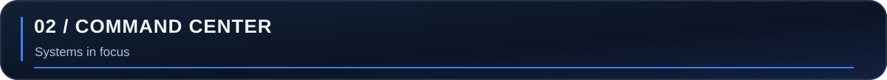
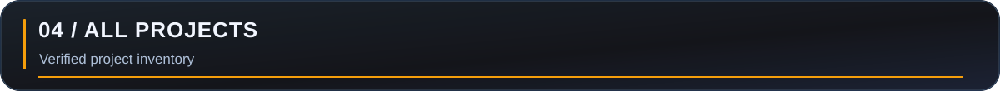
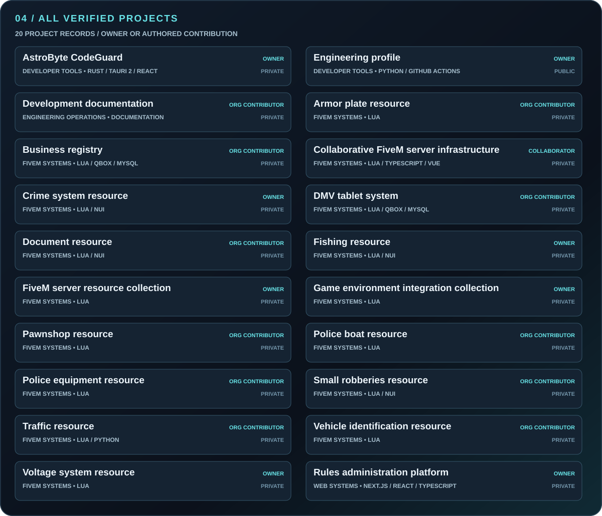
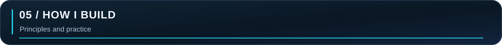
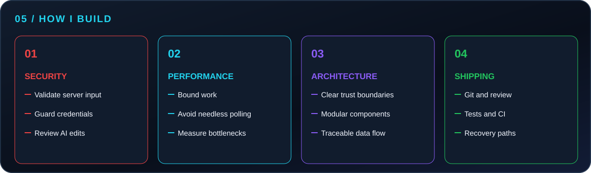
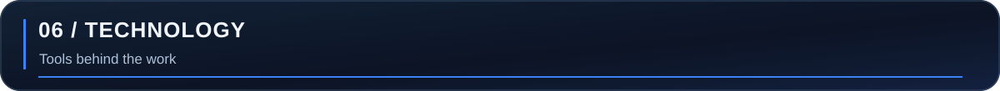
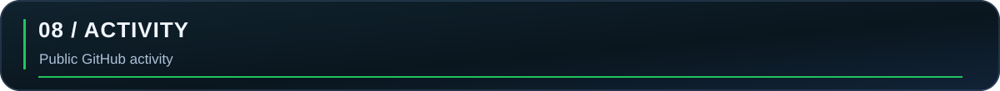
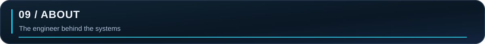
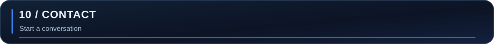

<strong>EN</strong> · <a href="README.bg.md">БГ</a>

<picture><source media="(max-width: 650px)" srcset="assets/generated/hero-en-mobile.svg"></picture>

<a href="#command-center">Command center</a> · <a href="#featured-systems">Featured systems</a> · <a href="#all-projects">All projects</a> · <a href="#architecture">Architecture</a> · <a href="#activity">Activity</a> · <a href="#contact">Contact</a>

<picture><source media="(max-width: 650px)" srcset="assets/generated/command-en-mobile.svg"></picture>

I work across local developer tooling, FiveM server resources, and web administration. The technologies below are grounded in inspected repositories; the project inventory distinguishes personal work from collaborative contributions.

### AstroByte CodeGuard · local code intelligence

<picture><source media="(max-width: 650px)" srcset="assets/generated/feature-codeguard-en-mobile.svg"></picture>

**Problem → solution.** Code findings need evidence and fixes need a controlled review path. CodeGuard combines a Rust scanner and CLI with a macOS Tauri 2 / React desktop app. It presents source context and findings, then optionally requests a proposal from OpenAI or Anthropic. The app shows a diff, requires explicit approval, verifies the result, and keeps guarded fix history.

**My contribution:** personal repository with authored activity. **Engineering decisions:** local scanning, bounded and redacted AI context, credential storage in macOS Keychain, project-scoped source access, and conflict-aware revert are documented in the repository. **Status:** private development; no public source or release link.

### Rules administration platform · full-stack product

<picture><source media="(max-width: 650px)" srcset="assets/generated/feature-rules-en-mobile.svg"></picture>

**Problem → solution.** Server rules need a public reading experience and a controlled editorial workflow. The private personal project uses Next.js, React, TypeScript, PostgreSQL and Prisma. Its repository documents Discord OAuth administration, drafts and publishing, revision history, server-side access checks, and an audit log.

**My contribution:** personal repository with authored commits. **Status:** private; no demo is claimed.

### DMV tablet · FiveM workflow

<picture><source media="(max-width: 650px)" srcset="assets/generated/feature-dmv-en-mobile.svg"></picture>

**Project:** a private AstroByte Development Qbox resource with a FiveM NUI tablet, Lua client/server code, vehicle registration records and MySQL persistence. Its README documents registration, plate history, QR verification, and localization.

**My contribution:** authored commits are present, including a release change. This is an **organization project**; the full system is not attributed to me alone. **Status:** private source.

### Business registry · FiveM records

<picture><source media="(max-width: 650px)" srcset="assets/generated/feature-registry-en-mobile.svg"></picture>

**Project:** a private AstroByte Development Qbox resource for business records and documents. The repository README describes server-side validation, MySQL activity logs, localization and a tablet interface.

**My contribution:** an authored initial repository commit is visible. It establishes contribution, not sole ownership of every later change. **Status:** private source.

### Collaborative FiveM server infrastructure

<picture><source media="(max-width: 650px)" srcset="assets/generated/feature-collaboration-en-mobile.svg"></picture>

**Project:** a shared private FiveM repository under another developer's account. **My contribution:** 44 authored commits were observed on accessible branches during the audit, including a database change. This is a **collaborative project**; the visual describes the shared system and does not claim its full implementation as mine. **Status:** private source.

<picture><source media="(max-width: 650px)" srcset="assets/generated/matrix-en-mobile.svg"></picture>

The matrix is generated from [the public-safe project inventory](data/projects.json). It includes all 20 accessible repositories with personal ownership or observed authored contributions, including this profile. Five additional organization repositories were reviewed and excluded because no authored contribution was established. Private entries use descriptive labels and omit repository URLs. A commit proves an authored change; it does not prove sole authorship of the project. [Discovery method and limits](docs/discovery.md).

<picture><source media="(max-width: 650px)" srcset="assets/generated/engineering-en-mobile.svg"></picture>

The strongest evidence is in the systems themselves: CodeGuard's explicit diff review and guarded revert; the rules platform's server-side access control, revision history and audit log; and the Qbox registry's server validation. These are project-specific decisions, not a claim that every repository implements the same safeguards.

<picture><source media="(max-width: 650px)" srcset="assets/generated/technology-en-mobile.svg"></picture>

Language activity uses **source-file touches in authored, non-merge commits** across accessible personal and contributed repositories. A file touched in two commits counts twice. It does not measure code ownership or proficiency, and it includes no private source text. The snapshot is refreshed only during an authenticated audit; the public workflow cannot access private repositories. [Method](docs/discovery.md).

<picture><source media="(max-width: 650px)" srcset="assets/generated/languages-en-mobile.svg"></picture>

These are high-level maps of components confirmed by repository documentation or structure. Optional and internal paths are intentionally simplified.

<picture><source media="(max-width: 650px)" srcset="assets/generated/architecture-codeguard-en-mobile.svg"></picture>

<picture><source media="(max-width: 650px)" srcset="assets/generated/architecture-rules-en-mobile.svg"></picture>

<picture><source media="(max-width: 650px)" srcset="assets/generated/architecture-dmv-en-mobile.svg"></picture>

<picture><source media="(max-width: 650px)" srcset="assets/generated/architecture-collaboration-en-mobile.svg"></picture>

<picture><source media="(max-width: 650px)" srcset="assets/metrics/activity-en-mobile.svg"></picture>

The card refreshes from GitHub's contribution calendar. Contributions are not equivalent to commits, hours or project ownership. The date on the card shows when it was generated. [Metric method](docs/metrics.md).

I build at the boundary between product interfaces and systems work: a scanner with guarded AI proposals, administrative workflows with explicit permissions, and FiveM resources connected to server logic and persistent data. I use Git, tests and documentation to make those systems easier to change and recover.

For developer tools, FiveM systems, or full-stack administration work, [contact me on GitHub](https://github.com/gopeto222). Email, website and Discord links will appear here when public contact details are available.

AstroByte Development · Georgi Kanchev · <a href="README.bg.md">Българска версия</a>
