<!-- Generated from data/profile.json and data/projects.json by scripts/build_readmes.py. -->

<a href="README.bg.md" title="Switch to Bulgarian"><picture><source media="(max-width: 650px)" srcset="assets/generated/hero-en-mobile.svg">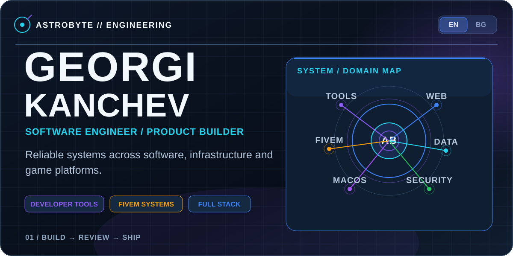</picture></a>

<a href="#featured">Selected systems</a> · <a href="#archive">Project archive</a> · <a href="#technology">Technology</a> · <a href="#activity">Activity</a> · <a href="#contact">Contact</a>

I build local developer tools, administrative web software and FiveM systems. The work below separates personal ownership from observed contributions.

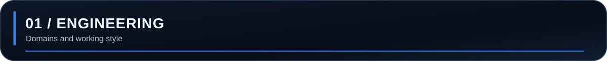

<picture><source media="(max-width: 650px)" srcset="assets/generated/command-en-mobile.svg">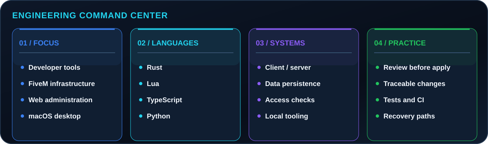</picture>

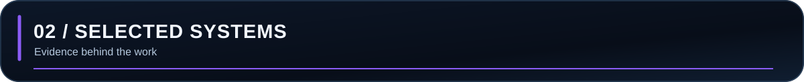

Selected work is described from repository evidence. Private sources remain private.

### AstroByte CodeGuard

<picture><source media="(max-width: 650px)" srcset="assets/generated/feature-codeguard-en-mobile.svg">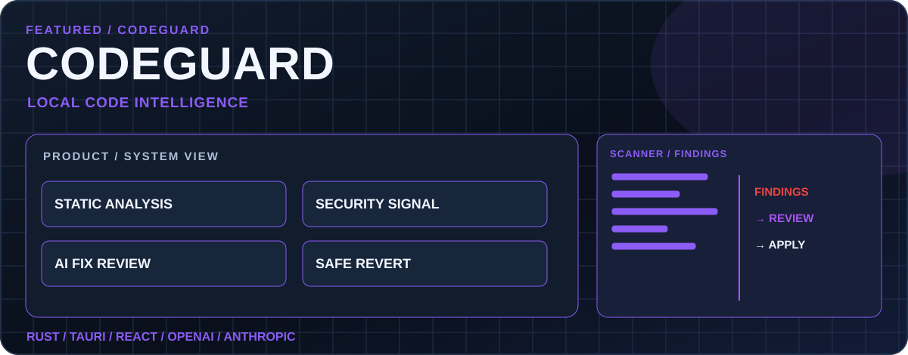</picture>

Verified system diagram; no product screenshot is implied.

- **Problem:** Findings need source context; proposed fixes need a review and recovery path.
- **System:** Rust scanner and CLI with a macOS Tauri 2 / React interface. Optional OpenAI or Anthropic proposals are shown as diffs before explicit approval.
- **My contribution:** Personal project with observed authored commits.
- **Engineering decision:** Local scanning, bounded and redacted AI context, Keychain credential storage, and conflict-aware revert.
- **Status:** Private development; no public release claimed.
- **Stack:** Rust · Tauri 2 · React · TypeScript · OpenAI · Anthropic

### Rules administration platform

<picture><source media="(max-width: 650px)" srcset="assets/generated/feature-rules-en-mobile.svg">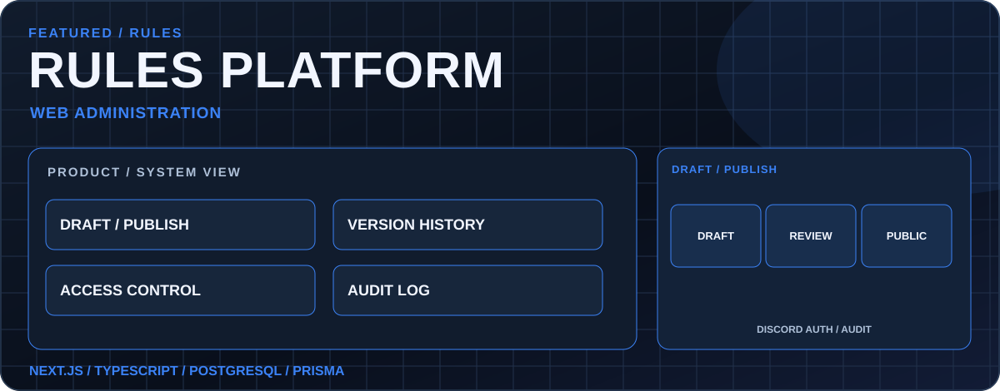</picture>

Verified system diagram; no product screenshot is implied.

- **Problem:** Community rules need a readable public view and a controlled editorial process.
- **System:** Next.js, React, TypeScript, PostgreSQL and Prisma with Discord OAuth administration, drafts, revisions and audit records.
- **My contribution:** Personal project with observed authored commits.
- **Engineering decision:** Server-side access checks and an auditable draft-to-publish workflow.
- **Status:** Private source; no public demo claimed.
- **Stack:** Next.js · React · TypeScript · PostgreSQL · Prisma

### DMV tablet system

<picture><source media="(max-width: 650px)" srcset="assets/generated/feature-dmv-en-mobile.svg">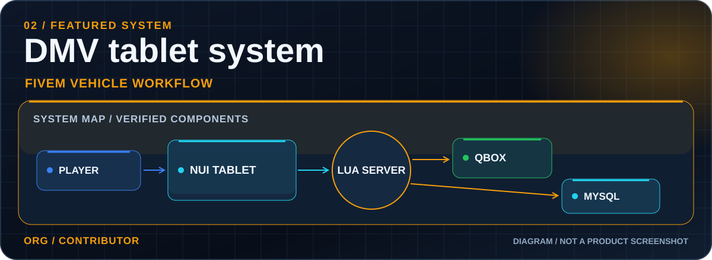</picture>

Verified system diagram; no product screenshot is implied.

- **Problem:** Vehicle registration needs an in-game workflow with persistent records and verifiable history.
- **System:** FiveM NUI tablet, Lua client/server code, Qbox integration and MySQL records. Repository documentation describes registration, plate history, QR checks and localization.
- **My contribution:** Authored commits are observed, including a release change; this is an organization project.
- **Engineering decision:** The system connects client interaction to server logic and persistent data.
- **Status:** Private organization source.
- **Stack:** Lua · Qbox · MySQL · NUI

### Business registry

<picture><source media="(max-width: 650px)" srcset="assets/generated/feature-registry-en-mobile.svg">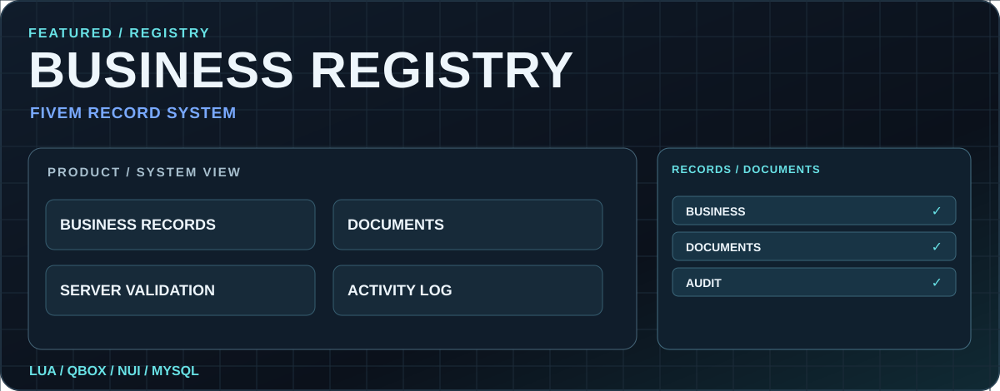</picture>

Verified system diagram; no product screenshot is implied.

- **Problem:** Business records and documents need a structured workflow with server checks.
- **System:** A Qbox tablet resource with MySQL records, localization and activity logging described by its repository.
- **My contribution:** An authored initial commit is observed. It does not establish sole ownership of later changes.
- **Engineering decision:** Server-side validation protects the record flow; activity logs make changes traceable.
- **Status:** Private organization source.
- **Stack:** Lua · Qbox · MySQL

### Collaborative FiveM infrastructure

<picture><source media="(max-width: 650px)" srcset="assets/generated/feature-collaboration-en-mobile.svg">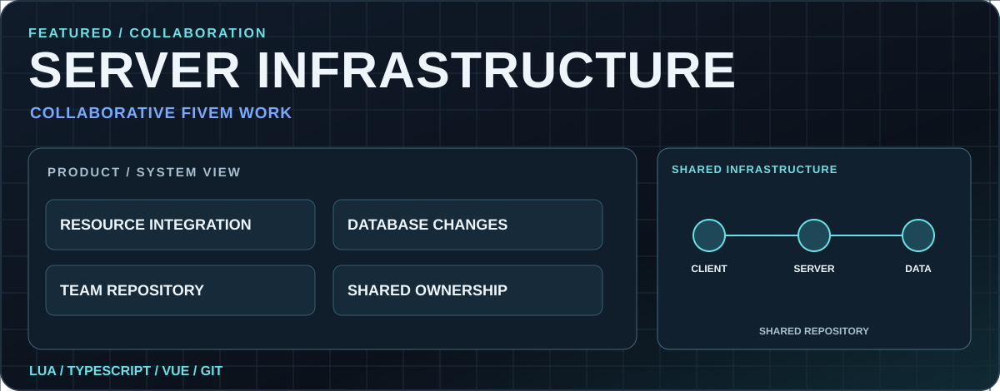</picture>

Verified system diagram; no product screenshot is implied.

- **Problem:** A shared FiveM system needs coordinated resource and data changes across contributors.
- **System:** Accessible history shows Lua and TypeScript resource work plus a database change in a private shared repository.
- **My contribution:** 44 authored commits were observed on accessible branches. The whole system is not attributed to one person.
- **Engineering decision:** The portfolio labels the system as collaborative and limits its claims to observed work.
- **Status:** Private collaborative source.
- **Stack:** Lua · TypeScript · Vue

20 verified records from 25 accessible repositories. 5 organization repositories were excluded because authored work was not established. Personal ownership, organization contributions and collaborative work are labeled separately. [Audit method](docs/discovery.md).

#### Developer tools

<picture><source media="(max-width: 650px)" srcset="assets/generated/archive-tools-en-mobile.svg">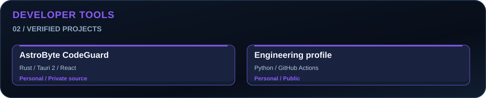</picture>

#### Engineering operations

<picture><source media="(max-width: 650px)" srcset="assets/generated/archive-operations-en-mobile.svg">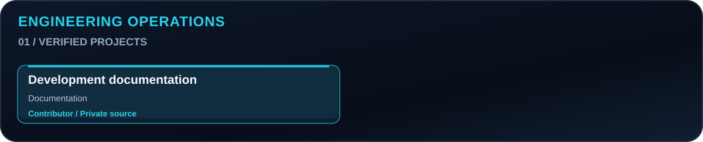</picture>

#### FiveM systems

<picture><source media="(max-width: 650px)" srcset="assets/generated/archive-fivem-en-mobile.svg">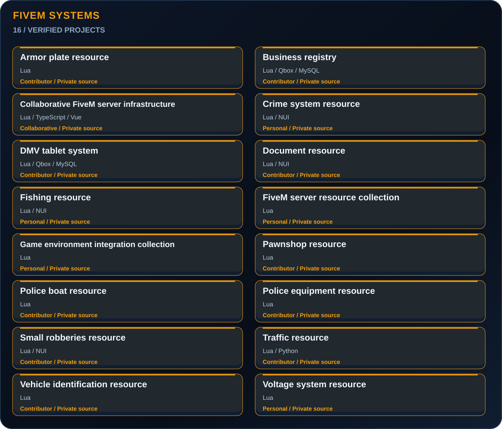</picture>

#### Web systems

<picture><source media="(max-width: 650px)" srcset="assets/generated/archive-web-en-mobile.svg">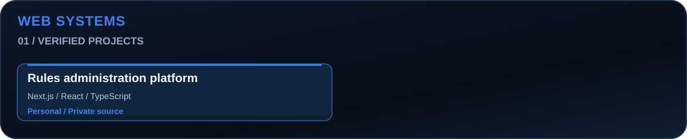</picture>

[Public source: this profile repository](https://github.com/gopeto222/gopeto222).

<picture><source media="(max-width: 650px)" srcset="assets/generated/fivem-en-mobile.svg">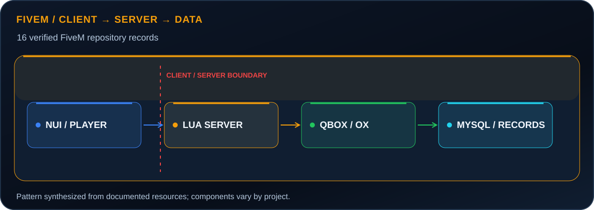</picture>

This is a pattern across documented resources, not a claim that every resource uses every component. The DMV and registry cases above provide concrete examples.

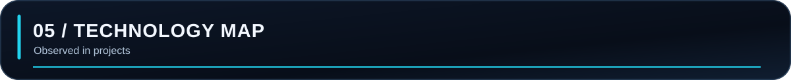

<picture><source media="(max-width: 650px)" srcset="assets/generated/technology-en-mobile.svg">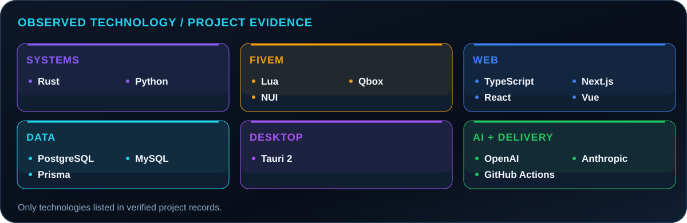</picture>

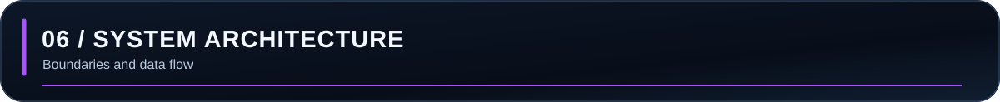

The diagrams show documented components and important boundaries. Optional integrations are labeled.

#### AstroByte CodeGuard

<picture><source media="(max-width: 650px)" srcset="assets/generated/architecture-codeguard-en-mobile.svg">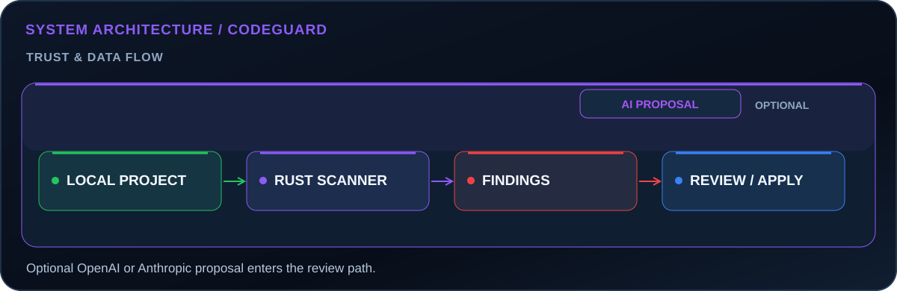</picture>

#### Rules administration platform

<picture><source media="(max-width: 650px)" srcset="assets/generated/architecture-rules-en-mobile.svg">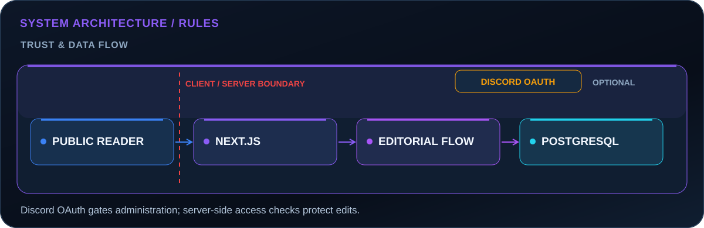</picture>

#### DMV tablet system

<picture><source media="(max-width: 650px)" srcset="assets/generated/architecture-dmv-en-mobile.svg">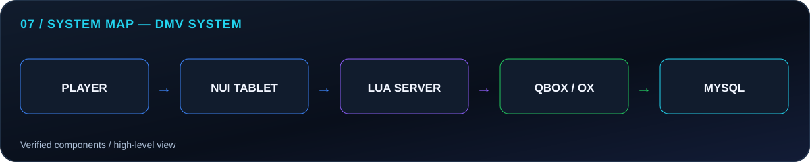</picture>

Additional architecture maps

#### Business registry

<picture><source media="(max-width: 650px)" srcset="assets/generated/architecture-registry-en-mobile.svg">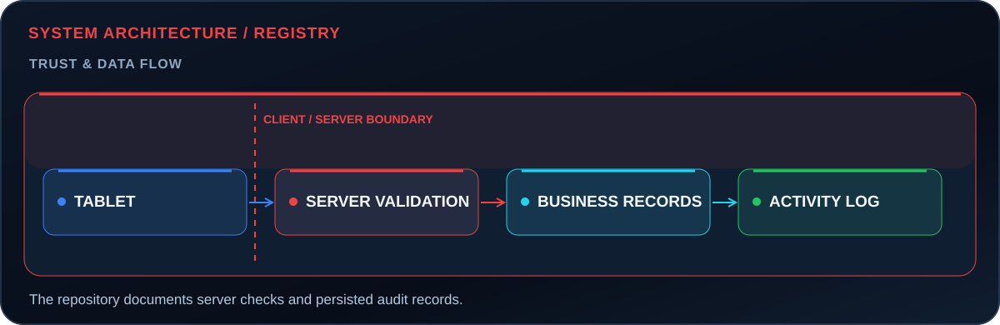</picture>

#### Collaborative FiveM infrastructure

<picture><source media="(max-width: 650px)" srcset="assets/generated/architecture-collaboration-en-mobile.svg">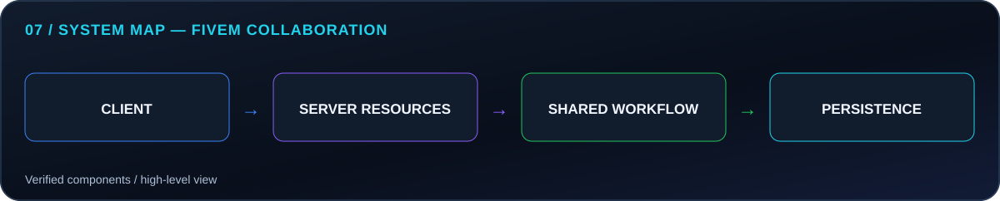</picture>

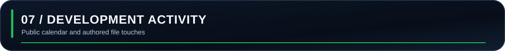

<picture><source media="(max-width: 650px)" srcset="assets/metrics/activity-en-mobile.svg">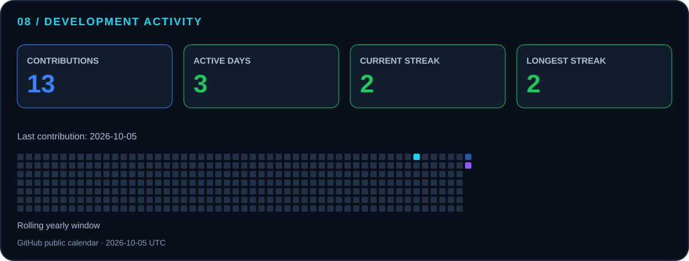</picture>

The card is generated from GitHub’s public contribution calendar. Counts are not hours, code ownership or project impact. [Metric method](docs/metrics.md).

<picture><source media="(max-width: 650px)" srcset="assets/generated/languages-en-mobile.svg">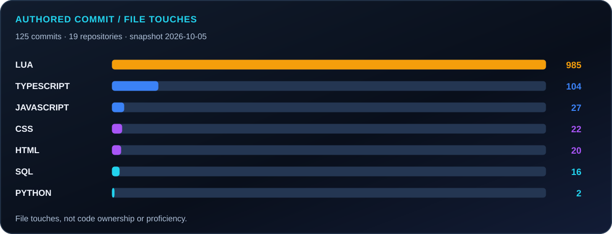</picture>

Language activity is a dated, contribution-aware snapshot of source-file touches. It does not measure proficiency. [Audit limits](docs/discovery.md).

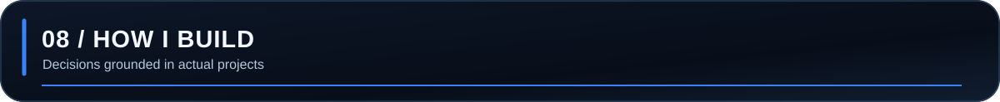

<picture><source media="(max-width: 650px)" srcset="assets/generated/practice-en-mobile.svg">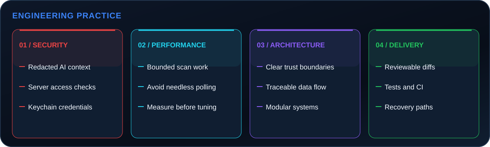</picture>

These are examples from specific projects, not a claim that every repository has the same safeguards.

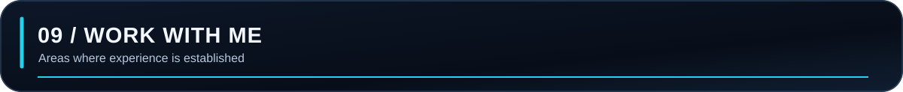

<picture><source media="(max-width: 650px)" srcset="assets/generated/services-en-mobile.svg">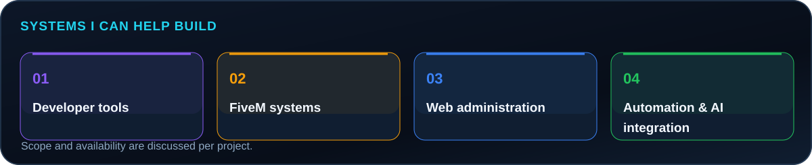</picture>

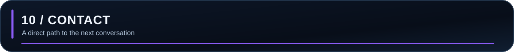

Have a tool, platform or system in mind? Start with a clear problem and a conversation on GitHub.

<a href="https://github.com/gopeto222" title="Contact Georgi on GitHub"><picture><source media="(max-width: 650px)" srcset="assets/generated/contact-en-mobile.svg">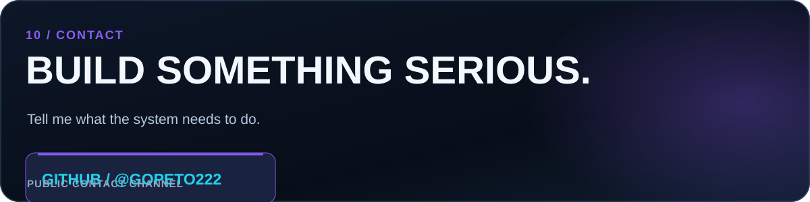</picture></a>

AstroByte Development · Georgi Kanchev · <a href="README.bg.md">Switch to Bulgarian</a>
